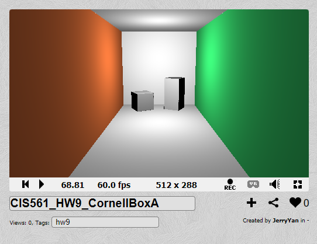
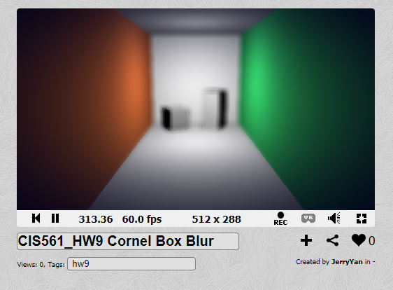
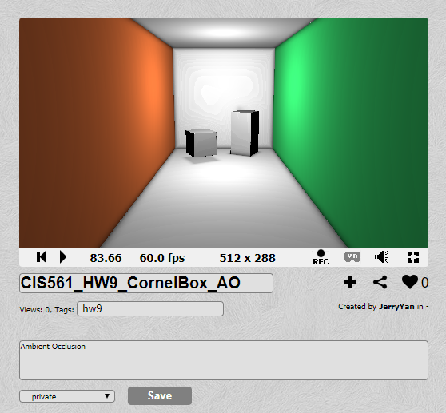
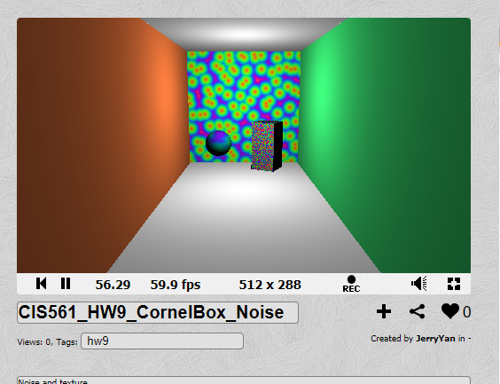
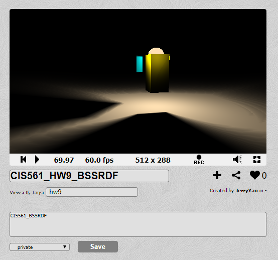
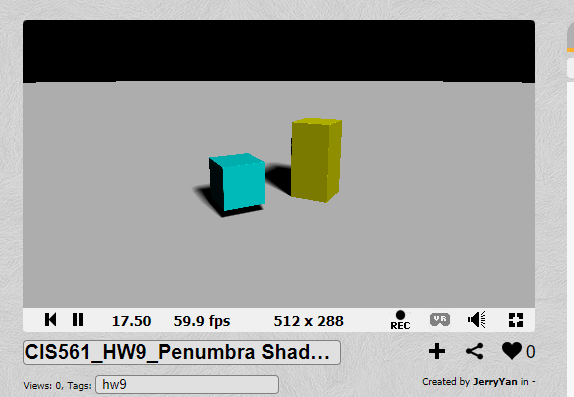

Jiarui Yan(jiaruiya) HW9 Test Result:
======================

Re-making a Cornell Box :
-------------
https://www.shadertoy.com/view/3dSyDw

Post-Processed Depth of Field:
-------------
https://www.shadertoy.com/view/tdSczd

Ambient Occlusion:
-------------
https://www.shadertoy.com/view/Ws2yRd

Practice with Noise and UV Mapping:
-------------
https://www.shadertoy.com/view/Wsjyzd

Subsurface Scattering Approximation and Penumbra Shadows:
-------------
https://www.shadertoy.com/view/tdScDy

Penumbra Shadows:
-------------
https://www.shadertoy.com/view/wdScDG

